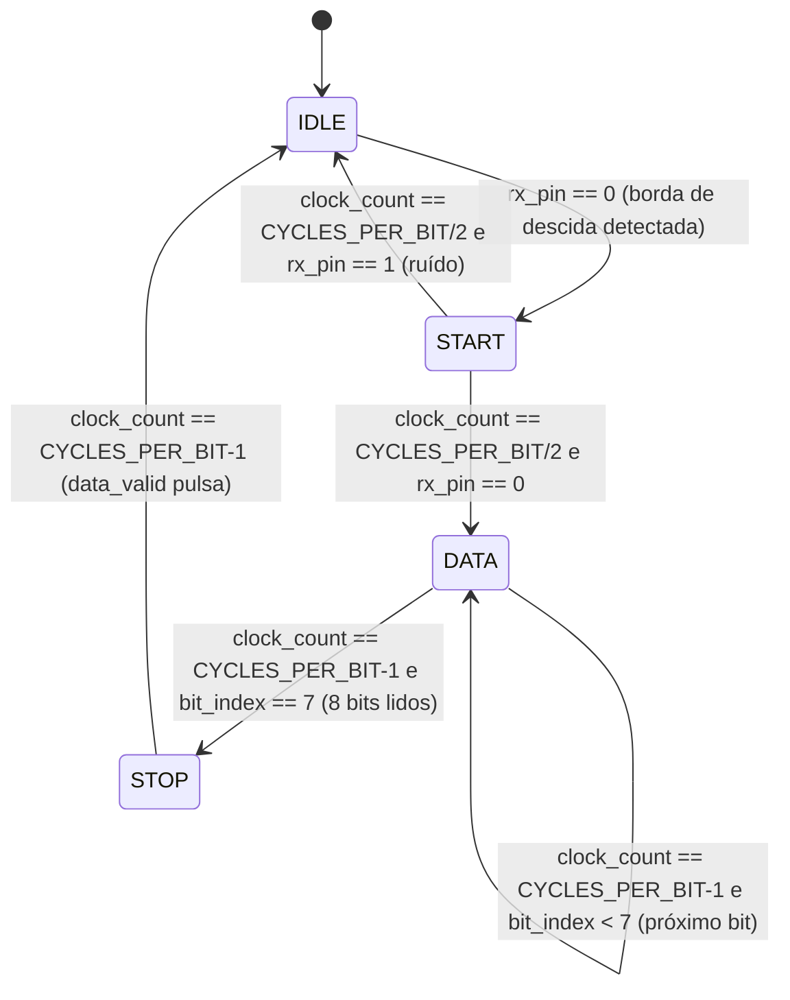
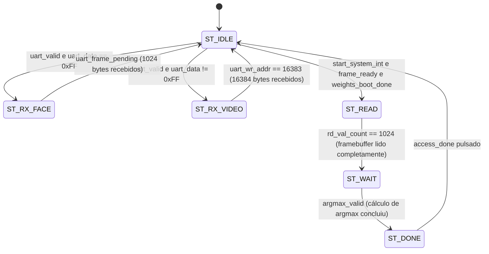
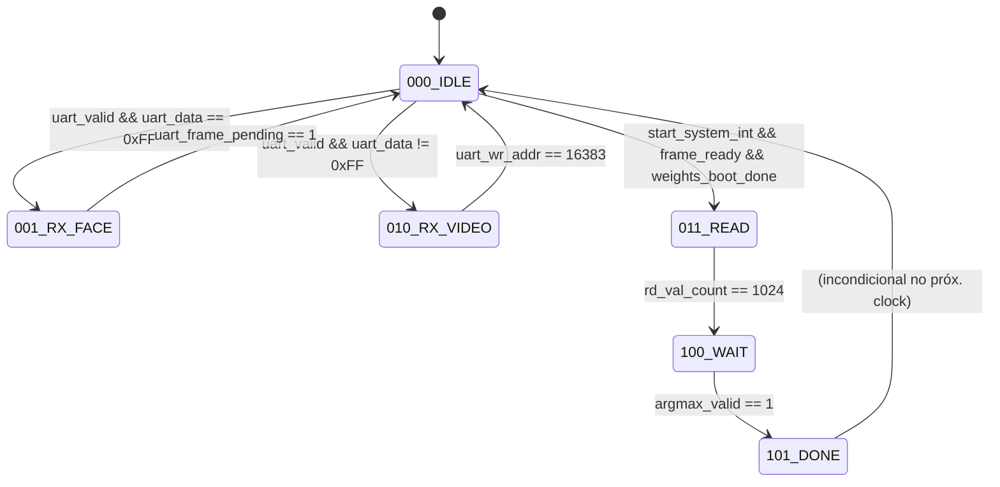
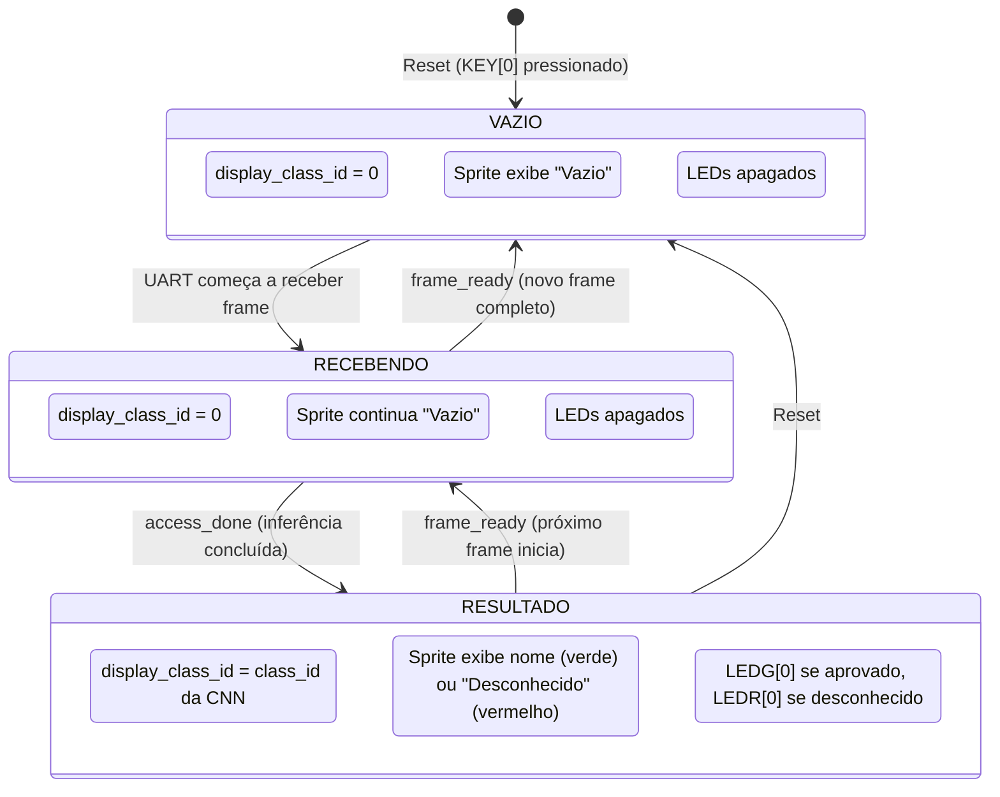
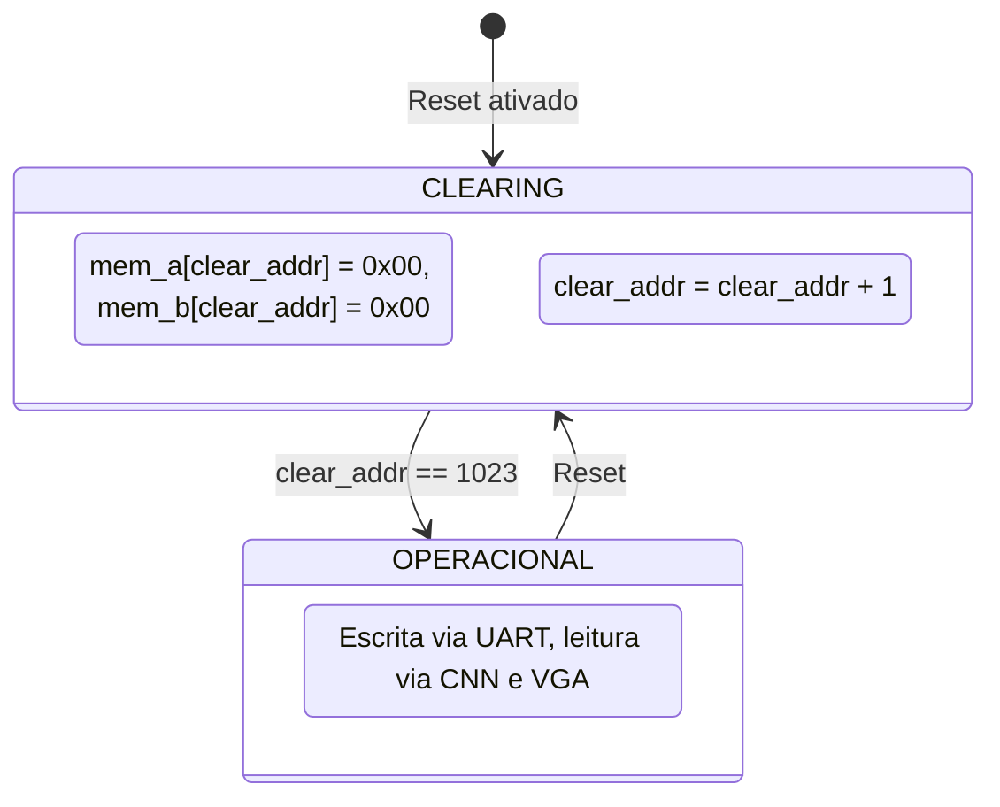
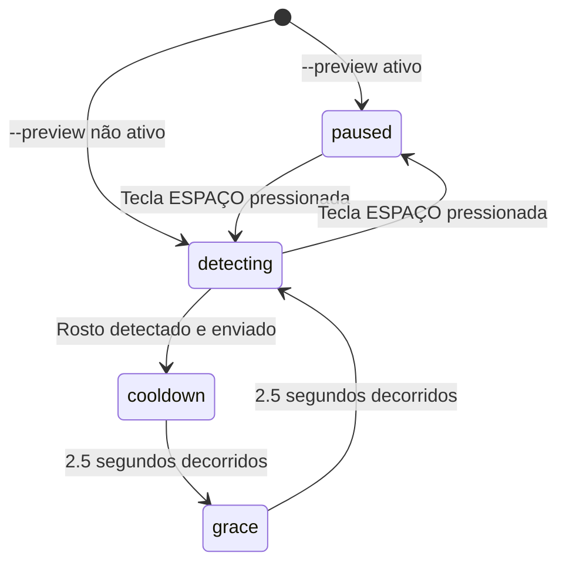
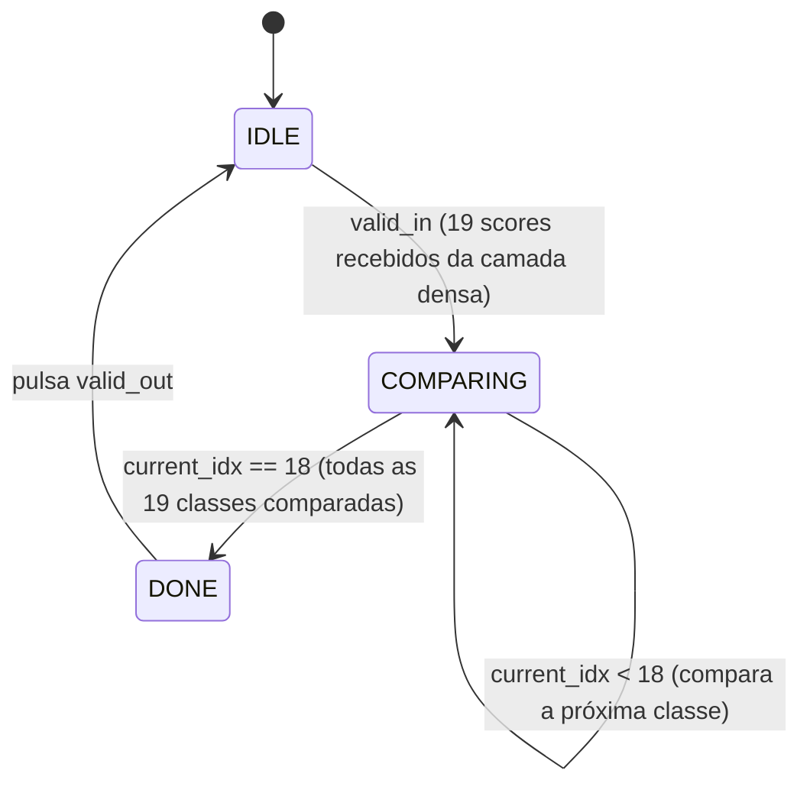

# Máquinas de Estado (FSMs) — Diagramas e Descrições

Este documento reúne todas as máquinas de estado presentes no projeto, tanto no hardware (Verilog) quanto no software (Python). Cada FSM é documentada com diagrama Mermaid, tabela de transições e descrição do comportamento.

**Documento principal:** [modulos_verilog.md](modulos_verilog.md) — Descrição completa dos módulos que contêm estas FSMs.

---

## 1. FSM do `uart_rx` — Recepção Serial

**Arquivo:** [uart_rx.v](../modulos_verilog/uart_rx.v)

**Descrição:** Controla a decodificação de um byte serial UART (8N1: 1 start bit, 8 data bits, 1 stop bit). Cada transição é sincronizada pelo contador `clock_count`, que mede o tempo de cada bit.

**Tabela de transições:**

| Estado atual | Condição | Próximo estado | Ação |
|-------------|----------|---------------|------|
| IDLE | `rx_pin == 0` | START | Início de possível transmissão |
| START | Metade do bit, `rx_pin == 0` | DATA | Start bit confirmado |
| START | Metade do bit, `rx_pin == 1` | IDLE | Falso alarme (ruído) |
| DATA | `CYCLES_PER_BIT-1` ciclos, `bit_index < 7` | DATA | Armazena bit em `shift_reg[bit_index]`, incrementa índice |
| DATA | `CYCLES_PER_BIT-1` ciclos, `bit_index == 7` | STOP | Último bit lido |
| STOP | `CYCLES_PER_BIT-1` ciclos | IDLE | `data_out <= shift_reg`, `data_valid <= 1` |

**Temporização:** Cada estado aguarda um número fixo de ciclos de clock determinado pela constante `CYCLES_PER_BIT = CLK_FREQ / BAUD_RATE`. A amostragem é feita no centro de cada bit para maximizar a margem de ruído.

---

## 2. FSM do `cnn_top` — Orquestrador da CNN

**Arquivo:** [cnn_top.v](../modulos_verilog/cnn_top.v)

**Descrição:** Controla todo o fluxo desde a recepção de dados pela UART até a conclusão da inferência. Possui 6 estados que gerenciam dois tipos de frames (rosto 32×32 e vídeo 128×128).

**Visão de Hardware (Estados em Binário):**

**Tabela de transições:**

| Estado atual | Condição | Próximo estado | Ação |
|-------------|----------|---------------|------|
| ST_IDLE | `uart_valid` e `uart_data == 0xFF` | ST_RX_FACE | Entra no modo de recepção de Rosto |
| ST_IDLE | `uart_valid` e `uart_data != 0xFF` | ST_RX_VIDEO | Entra no modo de recepção de Vídeo |
| ST_IDLE | `start_system_int` e `frame_ready` e `weights_boot_done` | ST_READ | Inicia leitura do framebuffer 32×32 |
| ST_RX_FACE | `uart_frame_pending` | ST_IDLE | `frame_mode <= 1`, frame de rosto completo |
| ST_RX_VIDEO | `uart_wr_addr == 16383` | ST_IDLE | `frame_mode <= 0`, frame de vídeo completo |
| ST_READ | `rd_val_count == 1024` | ST_WAIT | Todos os pixels lidos e enviados ao pipeline |
| ST_WAIT | `argmax_valid` | ST_DONE | argmax_19 encontrou o maior score |
| ST_DONE | — | ST_IDLE | Pulsa `access_done` por 1 ciclo |

**Fluxo de frame de rosto:** O byte de controle `0xFF` direciona a FSM para `ST_RX_FACE`, onde os próximos 1024 bytes são escritos no `framebuffer_32x32` via lógica combinacional (`uart_wr_en_comb`). Ao completar, `uart_frame_pending` é ativado, a FSM volta ao `ST_IDLE` e detecta o frame pendente, transitando para `ST_READ` para iniciar a inferência.

**Fluxo de frame de vídeo:** Qualquer byte de controle diferente de `0xFF` direciona para `ST_RX_VIDEO`, onde 16384 bytes são escritos no `framebuffer_128x128` via portas de saída registradas. Não há inferência — apenas exibição VGA.

---

## 3. FSM do `fpga_top_unified` — Orquestrador VGA + LEDs

**Arquivo:** [fpga_top_unified.v](../modulos_verilog/fpga_top_unified.v)

**Descrição:** Diferente das FSMs anteriores que usam estados explícitos, esta lógica é implementada como um registrador reativo (`display_class_id`) que responde a eventos do pipeline CNN. Controla qual nome é exibido no sprite VGA e o estado dos LEDs.

**Regras do registrador `display_class_id`:**

| Evento | Ação | Prioridade |
|--------|------|-----------|
| Reset (`rst`) | `display_class_id <= 0` | Mais alta |
| `access_done` | `display_class_id <= class_id` | Alta |
| `frame_ready` ou `frame_mode == 0` | `display_class_id <= 0` | Normal |
| Nenhum | Mantém valor atual | — |

**Determinação da cor do sprite:** O sinal `access_granted = (display_class_id > 1)` é usado para selecionar a cor do texto:

- `access_granted = 1` → texto verde (pessoa reconhecida)
- `access_granted = 0` → texto vermelho (desconhecido ou vazio)

**Latch dos LEDs:**

| Evento | LEDG[0] | LEDR[0] |
|--------|---------|---------|
| Reset | 0 | 0 |
| `access_done` e `class_id > 1` | 1 | 0 |
| `access_done` e `class_id == 1` | 0 | 1 |
| `access_done` e `class_id == 0` | 0 | 0 |
| `frame_ready` ou `frame_mode == 0` | 0 | 0 |

---

## 4. FSM do `framebuffer_32x32` — Clear por Hardware

**Arquivo:** [framebuffer_32x32.v](../modulos_verilog/framebuffer_32x32.v)

**Descrição:** Máquina simples que percorre todos os 1024 endereços escrevendo zeros após o reset, garantindo que a tela fique preta imediatamente.

**Tabela de transições:**

| Estado | Condição | Próximo estado | Ação |
|--------|----------|---------------|------|
| CLEARING | `clear_addr < 1023` | CLEARING | Escreve 0x00, incrementa `clear_addr` |
| CLEARING | `clear_addr == 1023` | OPERACIONAL | `clearing <= 0` |
| OPERACIONAL | Reset | CLEARING | `clearing <= 1`, `clear_addr <= 0` |

**Multiplexação de escrita:** Durante o clearing, o controle de escrita é direcionado ao contador de clear (dados = 0x00). Em operação normal, a escrita vem da UART (dados = pixel recebido). Isso é implementado por multiplexadores combinacionais (`actual_wr_en`, `actual_wr_addr`, `actual_wr_data`).

---

## 5. FSM do Script Python — Controle de Detecção

**Arquivo:** [send_image_32x32.py](../scripts/send_image_32x32.py)

**Descrição:** Controla o comportamento do modo de captura contínua da webcam, gerenciando quando rostos são procurados, quando pausar após detecção, e quando retomar.

**Tabela de transições:**

| Estado | Condição | Próximo estado | Ação |
|--------|----------|---------------|------|
| paused | Tecla ESPAÇO | detecting | Inicia busca por rostos |
| detecting | Rosto detectado | cooldown | Envia frame 32×32 + byte `0xFF` |
| detecting | Sem rosto | detecting | Envia frame 128×128 + byte `0x00` |
| detecting | Tecla ESPAÇO | paused | Para de buscar rostos |
| cooldown | 2.5s decorridos | grace | Nenhum frame enviado durante cooldown |
| grace | 2.5s decorridos | detecting | Envia apenas vídeo 128×128 durante grace |

**Justificativa dos temporizadores:**

- **Cooldown (2.5s):** Garante que a FPGA tenha tempo para concluir a inferência e exibir o resultado no VGA antes de receber um novo rosto.
- **Grace period (2.5s):** Evita que o mesmo rosto seja reenviado imediatamente após o cooldown, forçando um intervalo mínimo de apenas vídeo.

---

## 6. FSM do `argmax_19` — Máximo Sequencial

**Arquivo:** [argmax_19.v](../modulos_verilog/argmax_19.v)

**Descrição:** Implementação sequencial para encontrar a maior pontuação (argmax) entre as 19 classes. Ela consome 19 ciclos de clock, poupando a FPGA de violar os limites de temporização de hardware (timing violations) que ocorreriam numa implementação 100% combinacional em 1 ciclo.

**Tabela de transições:**

| Estado atual | Condição | Próximo estado | Ação |
|-------------|----------|---------------|------|
| IDLE | `valid_in` | COMPARING | `max_val <= scores[0]`, `current_idx <= 1` |
| COMPARING | `current_idx < 18` | COMPARING | Compara `scores[current_idx]` com `max_val` |
| COMPARING | `current_idx == 18` | DONE | Compara última classe |
| DONE | — | IDLE | `class_id <= max_idx + 1`, pulsa `valid_out` |
